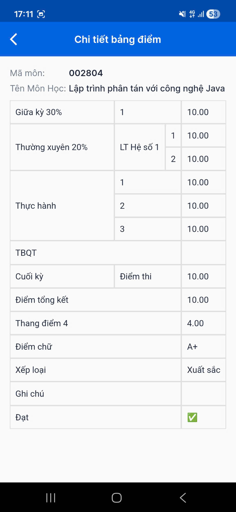

# Distributed Programming Learning Projects
Đây là các project học thực hành lập trình phân tán với công nghệ Java ở trường hằng tuần.

## Nội dung
- 4 Thread: Ôn tập trắc nghiệm thường kỳ lý thuyết
- 2 Json Process: Ôn tập thường kỳ thực hành 2
- 5 MID TERM: Ôn tập giữa kỳ
- 6 FINAL TERM: Ôn tập cuối kỳ

## Góc khoe

## Youtube
- YouTube: https://www.youtube.com/@HuynhDucPhu2502
- Playlist “Phân Tán Java”: https://youtube.com/playlist?list=PLImLByxRNRWPwkspUPWMLnqalgH3mfqkC&si=HHOt36x-FbcA4GSE

